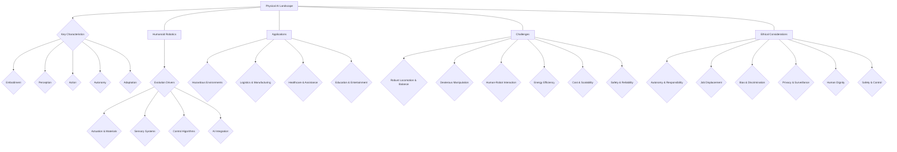

```mermaid
graph TD
    A[Physical AI Landscape] --> B{Key Characteristics}
    B --> C{Embodiment}
    B --> D{Perception}
    B --> E{Action}
    B --> F{Autonomy}
    B --> G{Adaptation}

    H[Humanoid Robotics] --> I{Evolution Drivers}
    I --> J{Actuation & Materials}
    I --> K{Sensory Systems}
    I --> L{Control Algorithms}
    I --> M{AI Integration}

    N[Applications] --> O{Hazardous Environments}
    N --> P{Logistics & Manufacturing}
    N --> Q{Healthcare & Assistance}
    N --> R{Education & Entertainment}

    S[Challenges] --> T{Robust Locomotion & Balance}
    S --> U{Dexterous Manipulation}
    S --> V{Human-Robot Interaction}
    S --> W{Energy Efficiency}
    S --> X{Cost & Scalability}
    S --> Y{Safety & Reliability}

    Z[Ethical Considerations] --> AA{Autonomy & Responsibility}
    Z --> BB{Job Displacement}
    Z --> CC{Bias & Discrimination}
    Z --> DD{Privacy & Surveillance}
    Z --> EE{Human Dignity}
    Z --> FF{Safety & Control}

    A --- H
    A --- N
    A --- S
    A --- Z
```