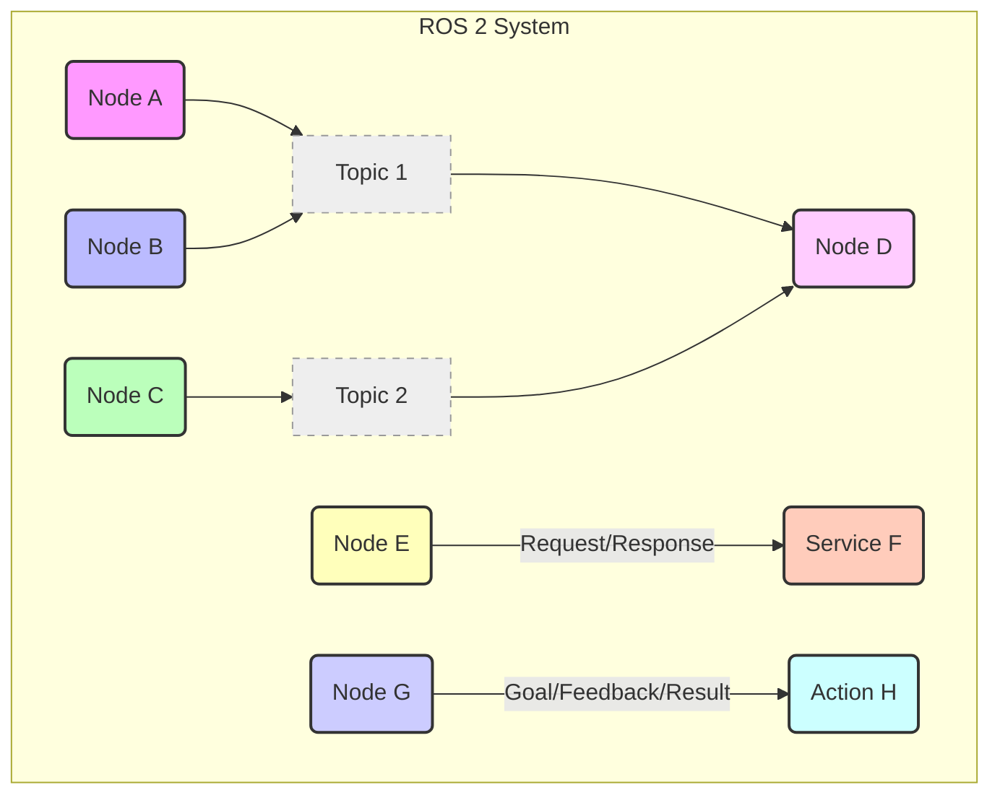

```mermaid
graph TD
    subgraph "ROS 2 System"
        NodeA(Node A) --> Topic1[Topic 1]
        NodeB(Node B) --> Topic1
        NodeC(Node C) --> Topic2[Topic 2]
        Topic1 --> NodeD(Node D)
        Topic2 --> NodeD
        NodeE(Node E) -- Request/Response --> ServiceF(Service F)
        NodeG(Node G) -- Goal/Feedback/Result --> ActionH(Action H)
    end

    style NodeA fill:#f9f,stroke:#333,stroke-width:2px
    style NodeB fill:#bbf,stroke:#333,stroke-width:2px
    style NodeC fill:#bfb,stroke:#333,stroke-width:2px
    style NodeD fill:#fcf,stroke:#333,stroke-width:2px
    style NodeE fill:#ffb,stroke:#333,stroke-width:2px
    style ServiceF fill:#fcb,stroke:#333,stroke-width:2px
    style NodeG fill:#ccf,stroke:#333,stroke-width:2px
    style ActionH fill:#cff,stroke:#333,stroke-width:2px

    style Topic1 fill:#eee,stroke:#999,stroke-dasharray: 5 5
    style Topic2 fill:#eee,stroke:#999,stroke-dasharray: 5 5
```